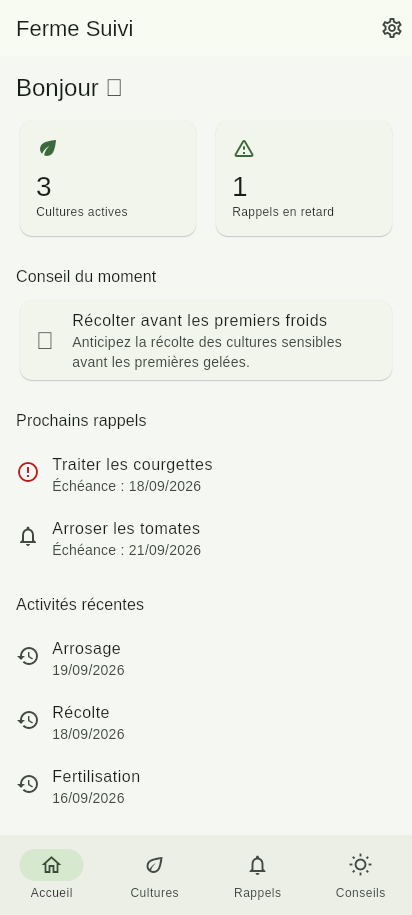
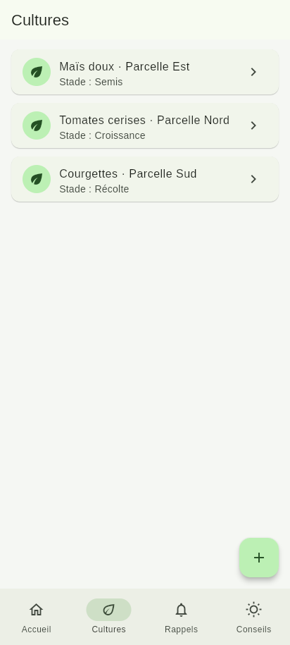
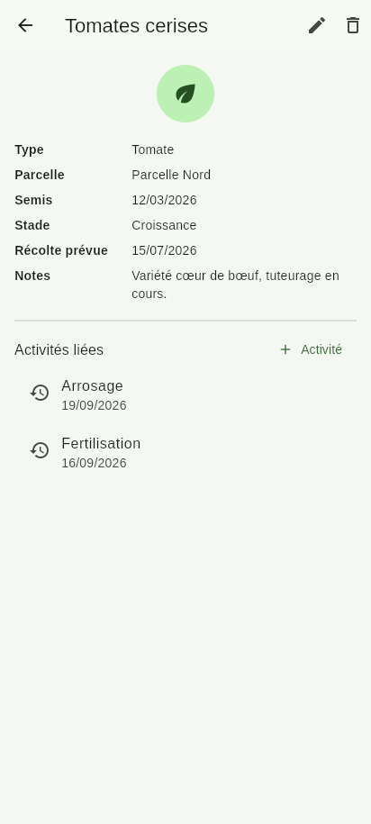
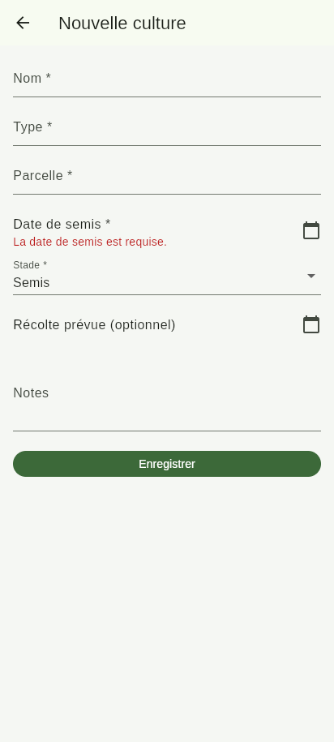
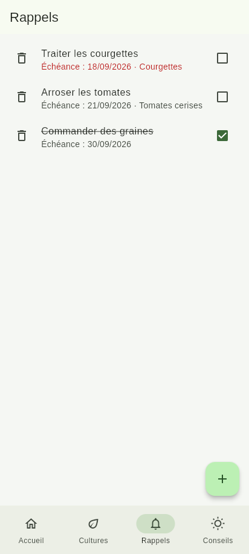
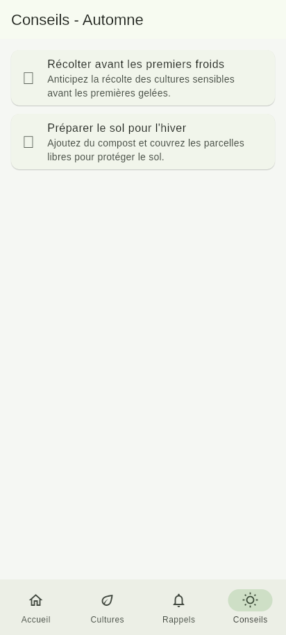

# Ferme Suivi

Application mobile Flutter de suivi de cultures pour petits exploitants et jardiniers,
**entièrement fonctionnelle hors ligne**. Projet réalisé dans le cadre du cours
*Développement Mobile — Niveau approfondi* (OIF / DCLIC), semaines 5 (conception) et 6
(réalisation).

## Objectif

De nombreux petits exploitants et jardiniers gèrent leurs cultures de manière informelle
(carnet papier, mémoire), ce qui entraîne des oublis d'entretien et une absence de suivi dans
le temps. Ferme Suivi centralise, sur le téléphone et **sans connexion réseau**, le suivi des
cultures d'une petite exploitation ou d'un jardin : état des cultures, historique des
activités, rappels de tâches et conseils saisonniers.

## Fonctionnalités principales

- **Tableau de bord** : nombre de cultures actives, rappels en retard, conseil du moment,
  prochains rappels et activités récentes.
- **Gestion des cultures** : créer, consulter, modifier, supprimer une culture (nom, type,
  parcelle, date de semis, stade, date de récolte prévue, notes).
- **Carnet d'activités** : enregistrer une activité (arrosage, fertilisation, traitement,
  désherbage, récolte, autre) liée à une culture et consulter son historique.
- **Rappels / alertes** : créer des rappels avec échéance, les associer à une culture, les
  marquer comme faits, visualiser les retards.
- **Conseils saisonniers** : conseils pratiques filtrés automatiquement selon la saison en
  cours (contenu embarqué, pas de connexion requise).

Toutes les données (cultures, activités, rappels) sont stockées **localement** sur
l'appareil via SQLite : l'application fonctionne à 100 % sans connexion réseau. Voir le choix
justifié dans [`docs/01-cahier-des-charges.md`](docs/01-cahier-des-charges.md#6-localisation-des-données).

## Documentation de conception (semaine 5)

- [`docs/01-cahier-des-charges.md`](docs/01-cahier-des-charges.md)
- [`docs/02-conception-visuelle.md`](docs/02-conception-visuelle.md) — wireframes, flux
  utilisateurs, style
- [`docs/03-conception-technique.md`](docs/03-conception-technique.md) — architecture,
  classes métier, packages, tests, déploiement

## Technologies et packages utilisés

| Package | Rôle |
| --- | --- |
| Flutter / Dart | Framework et langage |
| `provider` | Gestion d'état (ChangeNotifier) |
| `sqflite` + `path` | Stockage local relationnel (cultures, activités, rappels) |
| `intl` | Formatage des dates en français |
| `flutter_lints` *(dev)* | Règles d'analyse statique |
| `sqflite_common_ffi` *(dev)* | Exécution de SQLite en mémoire pour les tests |

Architecture du code (voir aussi [`docs/03-conception-technique.md`](docs/03-conception-technique.md)) :

```
lib/
├── main.dart          # Point d'entrée, injection des providers
├── app.dart            # MaterialApp, thème
├── models/              # Crop, Activity, Reminder, SeasonalTip
├── services/             # DatabaseService (SQLite), SeasonalAdviceService
├── repositories/          # Accès aux données (CRUD), isolent le SQL
├── providers/              # ChangeNotifier (state management via Provider)
├── screens/                 # Écrans (dashboard, crops, reminders, advice, settings)
├── widgets/                  # Widgets réutilisables
└── navigation/                 # Coquille de navigation (BottomNavigationBar)
```

## Installation

Prérequis : [Flutter SDK](https://docs.flutter.dev/get-started/install) (canal stable, testé
avec Flutter 3.47.5 / Dart 3.13.4) et un appareil ou émulateur Android/iOS.

```bash
git clone <url-du-depot>
cd ferme-suivi-flutter
flutter pub get
```

## Lancement de l'application

```bash
flutter run
```

### Générer une version installable (APK)

```bash
flutter build apk         # APK installable directement
# ou
flutter build appbundle   # Android App Bundle (.aab), pour publication
```

> **Remarque sur cet environnement de développement** : ce projet a été développé dans un
> environnement d'exécution en bac à sable dont la politique réseau bloque l'accès à
> `dl.google.com`, l'hôte utilisé par `sdkmanager`/Gradle pour télécharger les composants du
> SDK Android (plateformes, build-tools). Il n'a donc pas été possible d'y générer l'APK
> lui-même. Le code est entièrement prêt : sur un poste disposant d'Android Studio / du SDK
> Android configuré, les deux commandes ci-dessus produisent directement `build/app/outputs/flutter-apk/app-release.apk`
> (ou le `.aab` correspondant) sans modification du projet.

## Tests réalisés

```bash
flutter analyze   # analyse statique — aucun problème
flutter test      # 16 tests : modèles, repository SQLite, widgets, parcours utilisateur
```

Les tests de repository et d'écrans utilisent `sqflite_common_ffi` (mode
`databaseFactoryFfiNoIsolate`) pour exécuter une vraie base SQLite en mémoire sans émulateur.

| Type de test | Contenu |
| --- | --- |
| Tests unitaires | Sérialisation des modèles (`Crop`, `Reminder`), logique métier (`Reminder.isOverdue`) |
| Test de repository | CRUD complet de `CropRepository` sur une base SQLite en mémoire |
| Tests de widgets | Validation du formulaire de culture (messages d'erreur explicites) |
| Test de parcours utilisateur | Ajout d'une culture depuis la liste vide jusqu'à son apparition dans la liste, à travers l'UI réelle (formulaire, sélecteur de date, navigation) |

Résultat de la dernière exécution : **16/16 tests passent**, `flutter analyze` ne remonte
aucun problème.

## Captures d'écran

Les captures ci-dessous proviennent d'une exécution réelle de l'interface de l'application
(rendu Flutter, jeu de données de démonstration), pas de maquettes.

| Accueil | Cultures | Détail d'une culture |
| --- | --- | --- |
|  |  |  |

| Formulaire (validation) | Rappels | Conseils saisonniers |
| --- | --- | --- |
|  |  |  |

## Parcours de démonstration suggéré

1. Ajouter une culture depuis l'onglet **Cultures** (bouton `+`).
2. Ouvrir la fiche de la culture et enregistrer une activité (arrosage, fertilisation…).
3. Créer un rappel depuis l'onglet **Rappels**, l'associer à la culture.
4. Revenir à l'**Accueil** pour voir le résumé (cultures actives, prochains rappels,
   activités récentes, conseil du moment).
5. Consulter l'onglet **Conseils** pour les recommandations de la saison en cours.

## Difficultés rencontrées

- **Aucun SDK Android/iOS dans l'environnement de développement utilisé** : les outils de
  build mobiles (Android SDK, Xcode) n'étaient pas disponibles. Résolu en installant le SDK
  Flutter directement et en validant le code via `flutter analyze`/`flutter test`
  (exécutés sur un pseudo-appareil headless "flutter tester"), plutôt qu'en le lançant sur un
  émulateur.
- **`sqflite_common_ffi` bloquait les tests de widgets** : le mode par défaut de ce package
  ouvre la base de données dans un isolate séparé, ce qui provoquait un blocage indéfini à
  l'intérieur de la zone *fake async* utilisée par `flutter_test`. Résolu en utilisant
  `databaseFactoryFfiNoIsolate` (exécution synchrone, même isolate) dans les tests uniquement.
- **`ListView` et widgets hors écran dans les tests** : un `ListView(children: [...])`
  ne construit pas les enfants situés hors de la zone visible tant qu'on n'a pas défilé
  jusqu'à eux, ce qui faisait échouer `find.byKey` sur le bouton "Enregistrer" d'un long
  formulaire. Résolu en agrandissant la fenêtre de test pour que le formulaire tienne
  entièrement à l'écran.
- **`Provider` scopé sous `MaterialApp` au lieu d'au-dessus** : dans un premier test de
  parcours utilisateur, le `ChangeNotifierProvider` enveloppait l'écran passé en `home`
  plutôt que le `MaterialApp` lui-même, le rendant invisible aux écrans poussés sur la pile de
  navigation (`Navigator.push`). Résolu en plaçant le provider au-dessus du `MaterialApp`,
  comme dans `main.dart`.
- **Génération de l'APK impossible dans ce bac à sable** (voir section *Installation*
  ci-dessus) : `dl.google.com` est bloqué par la politique réseau de l'environnement. Les
  captures d'écran ont été obtenues via un build web de démonstration (Flutter CanvasKit +
  Chromium headless, jeu de données en mémoire), une solution de contournement utilisée
  uniquement pour la documentation et qui n'a laissé aucune trace dans le code de
  l'application (pas de plateforme web ni de dépendance ajoutée au projet final).

## Limites assumées

- Pas de compte utilisateur ni de synchronisation cloud (usage individuel, hors ligne).
- Pas de notifications système programmées (rappels consultés dans l'application).
- Conseils saisonniers en contenu fixe embarqué (non modifiable par l'utilisateur).

Détails complets dans [`docs/01-cahier-des-charges.md`](docs/01-cahier-des-charges.md).

## Auteur

Projet réalisé individuellement dans le cadre du cours *Développement Mobile — Niveau
approfondi* (OIF / DCLIC).
